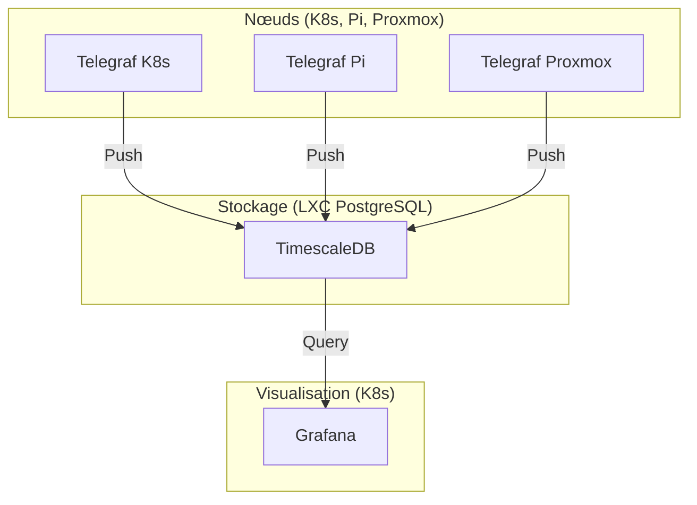

# Architecture Monitoring Lightweight (Telegraf + TimescaleDB)

Ce document décrit la recommandation pour un système de monitoring performant, durable et économe en ressources pour le **home_kluster** et l'infrastructure associée.

## 1. Pourquoi pas Prometheus ?
Bien que Prometheus soit le standard Kubernetes, il consomme environ **300 Mo à 500 Mo de RAM** au repos pour maintenir sa base de données en mémoire. Pour un homelab, ce coût est élevé si l'on ne cherche qu'à monitorer les ressources de base.

## 2. L'approche Telegraf + TimescaleDB
Cette architecture repose sur le modèle "Push" vers une base de données PostgreSQL existante, optimisée pour les séries temporelles via l'extension **TimescaleDB**.

### Avantages :
- **Légèreté** : L'agent Telegraf consomme ~20-50 Mo de RAM.
- **Mutualisation** : Réutilise l'instance PostgreSQL (LXC) déjà présente.
- **Long-terme** : TimescaleDB est idéal pour conserver des données sur plusieurs années (utile pour le futur projet MLOps/Finance).
- **SQL complet** : Permet des requêtes complexes impossibles en PromQL.

## 3. Architecture Cible

## 4. Composants

### Telegraf
- **DaemonSet K8s** : Collecte les métriques des nœuds et des pods.
- **Agent Raspberry Pi** : Collecte la température/humidité et les stats système.
- **Agent Proxmox** : Collecte les stats de l'hôte et de l'api PVE via le plugin `proxmox`.

### TimescaleDB
- Extension PostgreSQL activée sur l'instance existante.
- Organisation par schemas : `sensors`, `infra`, `finance`.

### Grafana
- Connecté en tant que Datasource PostgreSQL.
- Utilise des dashboards communautaires adaptés à Telegraf.

## 5. Comparaison de Ressources

| Composant | Stack Prometheus | Stack Telegraf (Cible) |
|-----------|------------------|------------------------|
| Collecteur | Prometheus (300MB+) | Telegraf (50MB) |
| Base de données | Intégrée | mutualisée (PostgreSQL) |
| Visualisation | Grafana (150MB) | Grafana (150MB) |
| **Total RAM** | **~450-600 MB** | **~200-250 MB** |
