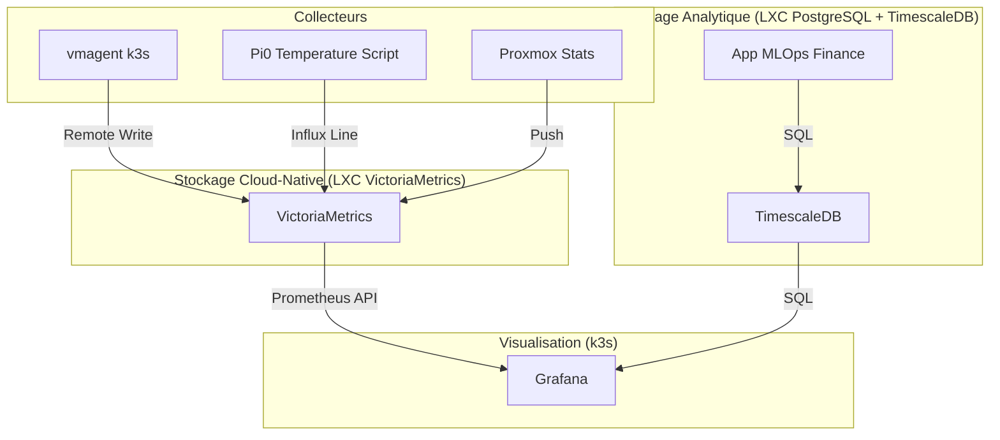

# Architecture Monitoring & Data (VictoriaMetrics + TimescaleDB)

Ce document décrit la nouvelle architecture pour le **home_kluster**, séparant le monitoring infrastructure des données analytiques métier.

## 1. Vision Globale
L'objectif est d'isoler le monitoring (haute fréquence d'écriture, moins critique) de la base de données de production/état de k3s.

## 2. Architecture Hybride

## 3. Stratégie de Stockage

| Type de Donnée | Outil | Pourquoi ? |
| --- | --- | --- |
| **Métriques Infra** (CPU, RAM, Temp) | **VictoriaMetrics** | Très léger, stockage optimisé, compatible Prometheus. |
| **Données Finance / ML** | **TimescaleDB** | Requêtes SQL complexes (jointures), précision critique, intégration Python/Pandas. |

## 4. Composants

### VictoriaMetrics (LXC Dédié)
- Rejoint les métriques de k3s (via `vmagent`).
- Rejoint les métriques du Raspberry Pi 0.
- Sert de datasource "Prometheus" pour Grafana.

### TimescaleDB (Extension PostgreSQL LXC)
- Utilisé pour le stockage long-terme des indicateurs financiers.
- Isolé des métriques de monitoring pur pour éviter les conflits d'I/O.

### Grafana
- Centralise la visualisation des deux sources.
