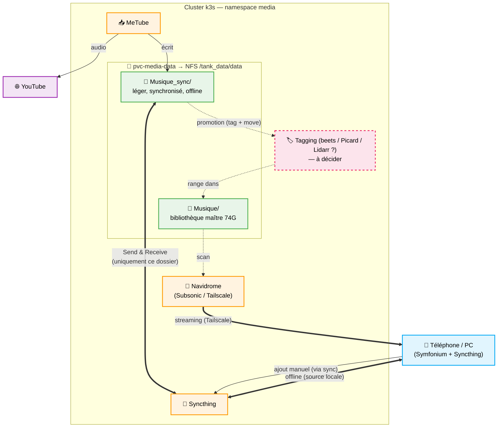

# Architecture de Gestion Musicale

> Dernière revue : juin 2026. État réel vérifié dans les manifests + cible recommandée.

## 1. État actuel (vérifié dans le repo)

Tout repose sur **un seul dataset ZFS** `tank_data/data` (mirror 2×HDD 14,6 To,
~2,55 To utilisés), exporté en NFS depuis le Proxmox `10.0.0.10` et monté via le
PVC `pvc-media-data` (10Ti, StorageClass `nfs-csi-hdd`, ReadWriteMany). Trois
applications principales se partagent ce volume.

| App | Image | Rôle | Vue du volume `pvc-media-data` | Exposition |
|-----|-------|------|--------------------------------|------------|
| **Navidrome** | `deluan/navidrome:0.62.0` | Streaming (API Subsonic) | bibliothèque unique `/music` = subPaths `Musique/` (74G) **+** `Musique_sync/` | `music.valab.top` + alias `navidrome.valab.top` + **Tailscale** |
| **MeTube** | `ghcr.io/alexta69/metube:latest` | Download YouTube | audio → `Musique_sync/`, vidéo → `pvc-media-video:/Download` | `tb.valab.top` |
| **Syncthing** | `lscr.io/linuxserver/syncthing:latest` | Sync multi-device | monte **toute la racine** `/data` | UI `syncthing.valab.top` (IP locale) + P2P MetalLB `10.0.0.102:22000` |

Jellyfin monte en plus `pvc-media-data` en **lecture seule** (`/media/data`) pour
la partie vidéo ; non central pour la musique.

### Stockage sous-jacent

```
Proxmox pve1 (10.0.0.10) — ZFS tank_data (mirror HDD 14,6 To)
  └── /tank_data/data        (export NFS, PV pv-media-data → PVC pvc-media-data)
        ├── Musique/          ← BIBLIOTHÈQUE MAÎTRE (14954 fichiers, 74G) — diffusée par Navidrome
        └── Musique_sync/     ← antichambre (cible MeTube + ajouts manuels), ~2G — offline only
```

> Attention nommage : la bibliothèque est `Musique/` (français). Un dossier
> `Music/` (anglais) **vide** traînait et était monté par erreur dans Navidrome
> (qui ne diffusait donc que `Musique_sync`) → supprimé, Navidrome pointe
> désormais sur `Musique/`.

StorageClasses (cf. `conf/nfs.yaml`) : `nfs-csi-hdd` (données massives, RWX,
ReclaimPolicy **Retain**), `nfs-csi-nvme` (DB/config petites, RWO — porte la
config Syncthing, navidrome-data, metube-state, jellyfin-config…).

### Convention de droits sur le NFS (important)

Le NFS est exporté en `no_root_squash` et l'arborescence `/tank_data/data` est
intégralement en **`root:root` (mode 775)**. Conséquence : **une app qui veut
écrire dans la musique doit tourner en root** (UID 0) ; en UID 1000 elle tombe
dans « others » → `r-x` → **lecture seule**. C'est la convention de fait du
cluster : metube, navidrome, qbittorrent tournent en root. Syncthing et
filebrowser étaient l'exception (UID 1000) → corrigés en root (cf. §3).

### Constats

1. **Modèle offline (révisé juin 2026)** : Navidrome scanne désormais **les deux
   dossiers** dans une **bibliothèque unique** (`Musique/` + `Musique_sync/`), pour
   que tout soit accessible à la curation de playlists. L'**offline ne passe plus
   par Syncthing** : Symfonium télécharge lui-même le sous-ensemble offline via
   l'API Subsonic. Comme Symfonium ne sait pas cibler un *dossier* (browsing par
   métadonnées), on lui donne un handle = une **smart playlist Navidrome filtrée sur
   `filepath contains "/Musique_sync/"`**, et on active l'**auto-cache** dessus.
   Voir `docs/playlists/`. Plus de doublon stream+local puisqu'il n'y a plus de
   source locale Syncthing.
2. **Syncthing monte la racine `/tank_data/data` entière** et sa config réelle vit
   dans le PVC `syncthing-config` (hors git, éditée à l'UI) : le périmètre
   réellement synchronisé n'est pas traçable dans le repo. Cette config a déjà été
   perdue une fois (recréation du PVC fin déc. 2025).
3. **Aucun outil de tagging/organisation** : les fichiers YouTube arrivent avec un
   nommage brut, ce qui dégrade l'affichage Navidrome.

## 2. Pertinence des briques (juin 2026)

- **Navidrome + Symfonium** : combo officiellement recommandé. Symfonium supporte
  nativement Subsonic/OpenSubsonic/Navidrome (cache offline, cast). **On garde.**
- **MeTube** : toujours maintenu, adapté au download *à la demande*. (Pinchflat
  vise l'archivage auto de chaînes → hors besoin.) **On garde.**
- **Syncthing** : **son rôle offline-musique disparaît** (remplacé par l'auto-cache
  Symfonium, cf. §1). À retirer du repo s'il ne sert qu'à la musique ; à conserver
  seulement s'il a un autre usage. *Décision en suspens.*
- **Tagging** : **beets retenu** (`apps/media/beets/`, en cours de déploiement,
  phase 1 = nettoyage de `Musique_sync/`). Picard/Lidarr écartés.

## 3. Cible recommandée

> ⚠️ **Révisé (juin 2026)** : le volet « offline via Syncthing » ci-dessous est
> **remplacé** par l'auto-cache Symfonium (cf. §1, constat 1). Le schéma et le
> §« correctif Syncthing » restent ici pour mémoire le temps de trancher le sort de
> Syncthing. Le reste (deux dossiers, promotion `Musique_sync/` → `Musique/`) tient.

Modèle à **deux dossiers aux rôles distincts**, avec Syncthing **cloisonné**.

- **`Musique_sync/`** — zone légère et mouvante : cible MeTube + ajouts manuels.
  **Seul dossier synchronisé** par Syncthing vers téléphones/PC (écoute offline).
  Doit rester petit.
- **`Musique/`** — bibliothèque maître : taggée/organisée, lourde (74G), **reste
  sur le serveur**, écoutée uniquement en streaming Navidrome via Tailscale.
- **Promotion** : périodiquement, le contenu de `Musique_sync/` est taggé puis
  déplacé vers `Musique/`, ce qui empêche `Musique_sync/` de gonfler et de saturer
  les appareils.

### Correctif technique à appliquer

> **Syncthing ne doit partager que le sous-dossier `Musique_sync/`**, pas la
> racine `/tank_data/data`. À vérifier/forcer dans l'UI (ou en figeant la config
> du dossier partagé). Mode conseillé : `Send & Receive` sur `Musique_sync/` si on
> veut pouvoir ajouter depuis un device, sinon `Send Only` côté serveur.



## 4. Décisions / TODO

- [x] **Droits NFS** : Syncthing et filebrowser passés en root (`PUID/PGID=0` /
      `runAsUser:0`) pour pouvoir écrire — ils étaient bloqués en lecture seule.
- [x] **PVC config Syncthing** : `pvc.yaml` réaligné `local-path → nfs-csi-nvme`
      (le réel ; le `local-path` du git n'avait jamais pris, champ immutable).
- [x] **Modèle offline révisé** : abandon de l'offline-via-Syncthing au profit de
      l'auto-cache Symfonium sur une smart playlist `filepath ~ /Musique_sync/`
      (cf. `docs/playlists/`). Navidrome scanne les deux dossiers (biblio unique).
- [x] **Tagging beets** : CronJob déployé (`apps/media/beets/`), 10:00, mode
      *singleton* auto (`quiet`/`skip`), plugins `musicbrainz`+`chroma`+`duplicates`
      +`fetchart`, `strong_rec_thresh: 0.20`, `incremental: no` + `move` (reprise
      auto après extinction), clé AcoustID en SealedSecret. ~97% de match mesuré.
      CronJob durci pour l'extinction nocturne (Replace, startingDeadline, activeDeadline).
- [~] **Import initial `Musique_sync`** : 1ère passe EN COURS (job manuel). Rangé en
      `Musique_sync/Non-Album/$artist/$title`. Les ~3% douteux restent à plat →
      session interactive plus tard (`beet import` sans `-q` en TTY via un pod).
- [ ] **Traiter `Musique/` (74G)** : ajouter au CronJob un 2e passage (config + DB
      dédiées, `directory: /music/Musique`) enchaîné APRÈS `Musique_sync` (un seul
      beets à la fois — PVC config RWO). ~16h → reprise sur ~2 jours (fenêtre 10h-minuit).
- [ ] **Dédup** : `beet duplicates` (liste) puis suppression contrôlée, quand voulu.
- [x] **qBittorrent** CrashLoopBackOff RÉSOLU : initContainer nettoyant le `lockfile`
      résiduel au démarrage (bug qBittorrent 5.2.x).
- [ ] **Déposer la smart playlist** `Offline - Musique_sync.nsp` sur le NFS (via
      Filebrowser dans `Musique/`) puis activer l'auto-cache dans Symfonium.
- [ ] **Sort de Syncthing** : confirmer qu'il ne sert qu'à la musique → si oui,
      retirer l'app (`apps/media/syncthing/` + `argocd/apps/`). Sinon documenter
      son autre usage.
- [ ] **Compte Navidrome pour ta copine** (auth header `Remote-User`) pour qu'elle
      crée ses playlists (cochées `Public` pour partage).
- [ ] Définir la cadence et le mode (manuel vs automatisé) de la **promotion**
      `Musique_sync/` → `Music/`.
- [ ] *(hors musique, cf. `TODO.md`)* généraliser `Retain` sur `nfs-csi-nvme`.
