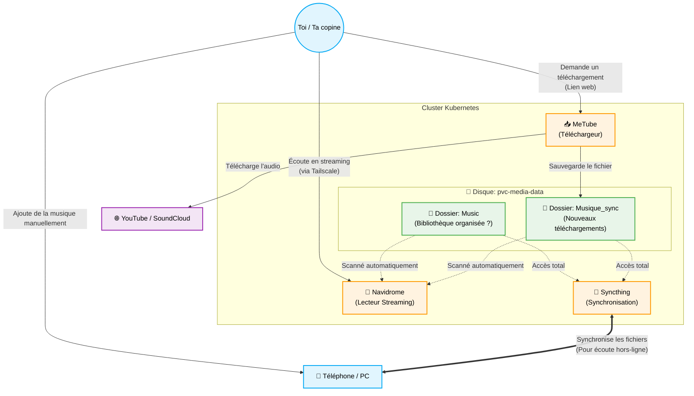

# Architecture de Gestion Musicale

Voici un schéma simplifié de ton installation actuelle pour gérer la musique, qui devrait aider à visualiser les flux de données et discuter des éventuelles améliorations d'architecture.

## Comment lire ce schéma

1.  **L'entrée (Téléchargement) :** Vous donnez un lien YouTube à **MeTube**. Il télécharge uniquement l'audio et le place dans le dossier `Musique_sync`.
2.  **L'écoute (Streaming) :** **Navidrome** surveille en permanence le dossier `Musique_sync` (et un autre dossier `Music`). Dès qu'un nouveau son arrive, il apparaît dans l'application Navidrome et vous pouvez l'écouter partout (tant que Tailscale est activé).
3.  **La sauvegarde / L'écoute hors-ligne (Syncthing) :** **Syncthing** voit tous ces dossiers. Si vous le configurez sur vos téléphones, il peut télécharger automatiquement en arrière-plan les musiques de `Musique_sync` pour que vous puissiez les écouter même dans l'avion ou sans connexion.

## Choix d'architecture (Questions à se poser)

*   **Organisation :** Actuellement, tout ce qui est téléchargé via MeTube va dans `Musique_sync` en vrac. Voulez-vous un système pour trier cette musique (par artiste/album) avant qu'elle n'aille dans le dossier final `Music` lu par Navidrome ?
*   **Synchronisation bidirectionnelle :** Si tu ajoutes des MP3 depuis ton PC vers le dossier `Music` via Syncthing, Navidrome les lira. Est-ce le comportement souhaité ?
*   **Nettoyage :** Que se passe-t-il quand vous supprimez une musique ? Si tu la supprimes sur ton téléphone, Syncthing la supprimera-t-il du cluster ? (Ça dépend de comment tu configures le dossier Syncthing : "Send Only", "Receive Only", ou "Send & Receive").
