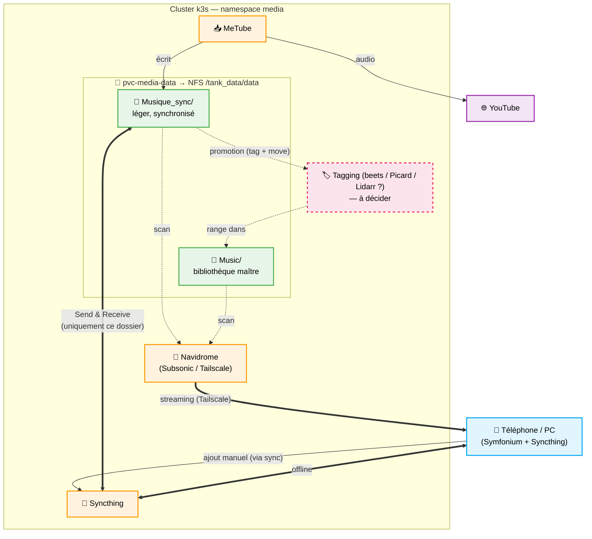

# Architecture de Gestion Musicale

> Dernière revue : juin 2026. État réel vérifié dans les manifests + cible recommandée.

## 1. État actuel (vérifié dans le repo)

Tout repose sur **un seul dataset ZFS** `tank_data/data` (mirror 2×HDD 14,6 To,
~2,55 To utilisés), exporté en NFS depuis le Proxmox `10.0.0.10` et monté via le
PVC `pvc-media-data` (10Ti, StorageClass `nfs-csi-hdd`, ReadWriteMany). Trois
applications principales se partagent ce volume.

| App | Image | Rôle | Vue du volume `pvc-media-data` | Exposition |
|-----|-------|------|--------------------------------|------------|
| **Navidrome** | `deluan/navidrome:0.56.0` | Streaming (API Subsonic) | `/music/Musique_sync` + `/music/Music` (2 subPaths) | `music.valab.top` + alias `navidrome.valab.top` + **Tailscale** |
| **MeTube** | `ghcr.io/alexta69/metube:latest` | Download YouTube | audio → `Musique_sync/`, vidéo → `pvc-media-video:/Download` | `tb.valab.top` |
| **Syncthing** | `lscr.io/linuxserver/syncthing:latest` | Sync multi-device | monte **toute la racine** `/data` | UI `syncthing.valab.top` (IP locale) + P2P MetalLB `10.0.0.102:22000` |

Jellyfin monte en plus `pvc-media-data` en **lecture seule** (`/media/data`) pour
la partie vidéo ; non central pour la musique.

### Stockage sous-jacent

```
Proxmox pve1 (10.0.0.10) — ZFS tank_data (mirror HDD 14,6 To)
  └── /tank_data/data        (export NFS, PV pv-media-data → PVC pvc-media-data)
        ├── Musique_sync/     ← cible download audio MeTube + ajouts manuels
        └── Music/            ← bibliothèque
```

StorageClasses (cf. `conf/nfs.yaml`) : `nfs-csi-hdd` (données massives, RWX,
ReclaimPolicy **Retain**), `nfs-csi-nvme` (DB/config petites, RWO — porte la
config Syncthing, navidrome-data, metube-state, jellyfin-config…).

### Convention de droits sur le NFS (important)

Le NFS est exporté en `no_root_squash` et l'arborescence `/tank_data/data` est
intégralement en **`root:root` (mode 775)**. Conséquence : **une app qui veut
écrire dans la musique doit tourner en root** (UID 0) ; en UID 1000 elle tombe
dans « others » → `r-x` → **lecture seule**. C'est la convention de fait du
cluster : metube, navidrome, qbittorrent tournent en root. Syncthing et
filebrowser étaient l'exception (UID 1000) → corrigés en root (cf. §3).

### Constats

1. **`Musique_sync/` et `Music/` sont deux frères dans le même dataset, tous deux
   scannés par Navidrome.** Le download YouTube est donc déjà dans la
   bibliothèque d'écoute, mais physiquement isolé dans son sous-dossier.
2. **Syncthing monte la racine `/tank_data/data` entière** et sa config réelle vit
   dans le PVC `syncthing-config` (hors git, éditée à l'UI) : le périmètre
   réellement synchronisé n'est pas traçable dans le repo. Cette config a déjà été
   perdue une fois (recréation du PVC fin déc. 2025).
3. **Aucun outil de tagging/organisation** : les fichiers YouTube arrivent avec un
   nommage brut, ce qui dégrade l'affichage Navidrome.

## 2. Pertinence des briques (juin 2026)

- **Navidrome + Symfonium** : combo officiellement recommandé. Symfonium supporte
  nativement Subsonic/OpenSubsonic/Navidrome (cache offline, cast). **On garde.**
- **MeTube** : toujours maintenu, adapté au download *à la demande*. (Pinchflat
  vise l'archivage auto de chaînes → hors besoin.) **On garde.**
- **Syncthing** : référence P2P multi-device. **On garde.**
- **Tagging** : seul maillon manquant. Décision à trancher en fin de chantier
  (candidats : beets CLI/auto, MusicBrainz Picard GUI, ou Lidarr). **En suspens.**

## 3. Cible recommandée

Modèle à **deux dossiers aux rôles distincts**, avec Syncthing **cloisonné**.

- **`Musique_sync/`** — zone légère et mouvante : cible MeTube + ajouts manuels.
  **Seul dossier synchronisé** par Syncthing vers téléphones/PC (écoute offline).
  Doit rester petit.
- **`Music/`** — bibliothèque maître : taggée/organisée, lourde, **reste sur le
  serveur**, écoutée uniquement en streaming Navidrome via Tailscale.
- **Promotion** : périodiquement, le contenu de `Musique_sync/` est taggé puis
  déplacé vers `Music/`, ce qui empêche `Musique_sync/` de gonfler et de saturer
  les appareils.

### Correctif technique à appliquer

> **Syncthing ne doit partager que le sous-dossier `Musique_sync/`**, pas la
> racine `/tank_data/data`. À vérifier/forcer dans l'UI (ou en figeant la config
> du dossier partagé). Mode conseillé : `Send & Receive` sur `Musique_sync/` si on
> veut pouvoir ajouter depuis un device, sinon `Send Only` côté serveur.



## 4. Décisions / TODO

- [x] **Droits NFS** : Syncthing et filebrowser passés en root (`PUID/PGID=0` /
      `runAsUser:0`) pour pouvoir écrire — ils étaient bloqués en lecture seule.
- [x] **PVC config Syncthing** : `pvc.yaml` réaligné `local-path → nfs-csi-nvme`
      (le réel ; le `local-path` du git n'avait jamais pris, champ immutable).
- [ ] **Reconfig Syncthing (UI)** : recréer le dossier partagé `Musique_sync/`
      (`Send & Receive`) et **ré-appairer** les devices (le device ID a changé,
      l'ancien appairage est mort). Restreindre le partage au **seul**
      `Musique_sync/`, pas la racine `/tank_data/data`.
- [ ] **Tagging** : choisir l'outil (beets / Picard / Lidarr) — *en suspens*.
- [ ] Définir la cadence et le mode (manuel vs automatisé) de la **promotion**
      `Musique_sync/` → `Music/`.
- [ ] *(hors musique, cf. `TODO.md`)* généraliser `Retain` sur `nfs-csi-nvme`.
- [ ] *(séparé)* qBittorrent en CrashLoopBackOff (liveness probe port 8080,
      exit 137) — sans rapport avec les droits.
